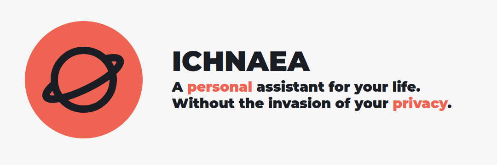
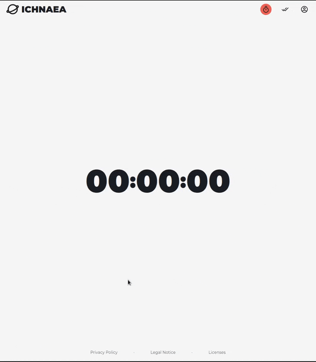
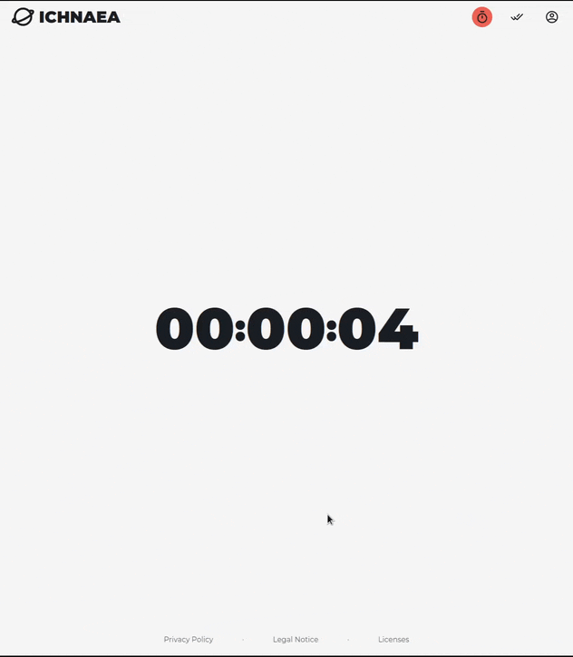
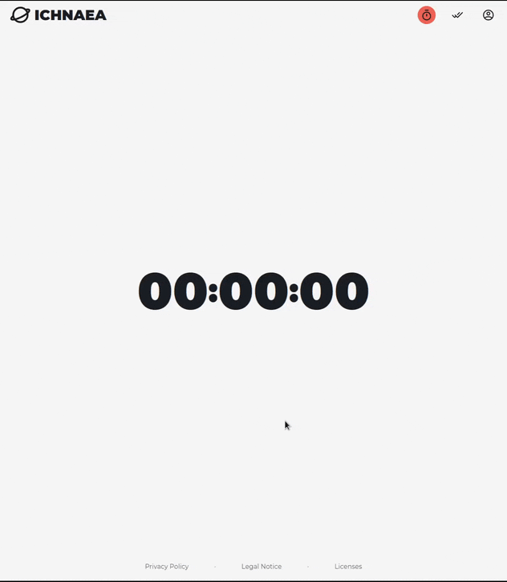
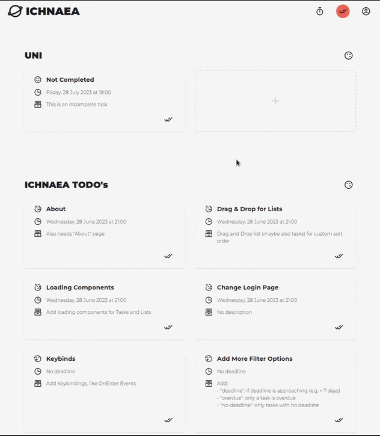
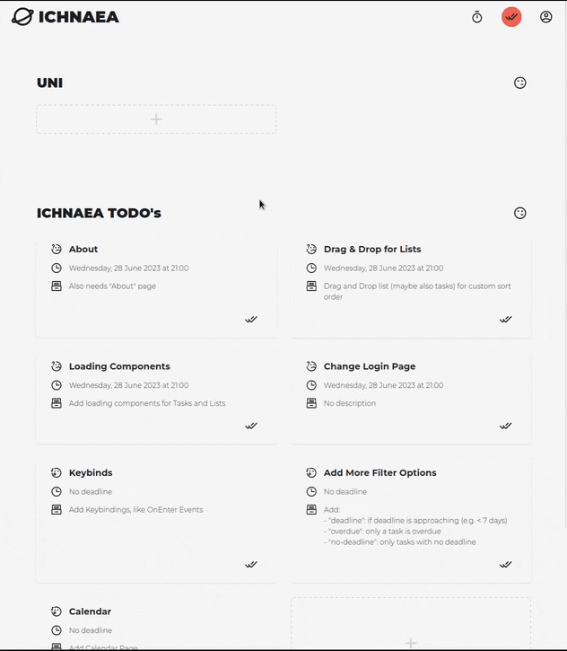

# ICHNAEA

ICHNAEA is a personal project to be a simple personal assistant without invasive data collection. The name comes from the Greek word for "tracker" which aims to fit the project's purpose, as the project is meant to be a simple and easy extendable web application for tracking and managing your everyday life.

## Design Philosophy

Note, as this project is meant to be a personal project, the design philosophy is based on my own preferences and needs. However, feel free to fork and modify it to your own needs, critique it, or even contribute to it.

### Frameworks

I chose [Next.js](https://nextjs.org/) + [Tailwind CSS](https://tailwindcss.com/) for the frontend, and left the backend open to your choice. I personally use [PocketBase](https://pocketbase.io/) for the backend, but you can use any other database service you want, or write your own backend. This is also why I chose to define REST API endpoints in the frontend, so that you can easily swap out the backend without having to change the frontend code (if you keep the data structure the same). A schema for the PocketBase database is included in the `database` folder.

### Hosting

Due to the nature of the project, it is meant to be self-hosted, and is only meant to be used by one or a few close friends/family.The hosting options are open to you, i.e. you can host it on a server and access it from anywhere, host it on a small local server/computer like a Raspberry Pi, or even just run it locally on your computer. For any option, you can use a tool like [Electron](https://www.electronjs.org/) (some adjustments needed) to package it into a desktop application and host your database somewhere reachable, use [ngrok](https://ngrok.com/) to expose it to the internet, or any other method you can think of. This is the idea of the project, to be flexible and open to your needs and preferences.

### Fonts

I chose the [Montserrat](https://fonts.google.com/specimen/Montserrat) font for the project, as it is a simple and clean font that is easy to read and looks good.

## Features / Roadmap

- [x] Timer (i.e. to use as Pomodoro, or to track time spent on different activities)
- [x] Todo List
- [ ] Habit Tracker
- [ ] Shopping/Ingredients Bucket like List (i.e. to use for meal planning, or to keep track of things you need to buy for certain activities, projects, etc.)
- [ ] Calendar
- [ ] Notes

All of these features are meant to be simple and easy to use, and when the project matures to be able to be used together. 

### Timer

|  |  |  |
| :-------------------------------------: | :----------------------------------: | :----------------------------------: |

The timer is meant to be a simple timer that can be used for Pomodoro, or to track time spent on different activities.

### Todo List

|  |  |  |
| :-----------------------------------------: | :---------------------------------------------: | :-------------------------------------: |

The todo list is as simple as it can be, lists to group items, and items to be checked off. The items can be edited and deleted, and the lists can be deleted. Items have a small Icon to the left of the title, indicating if it is completed, if the deadline is approaching, if it is overdue or if it has no deadline. The items are sorted by deadline, and grouped by if they are completed or not, which can be toggled.